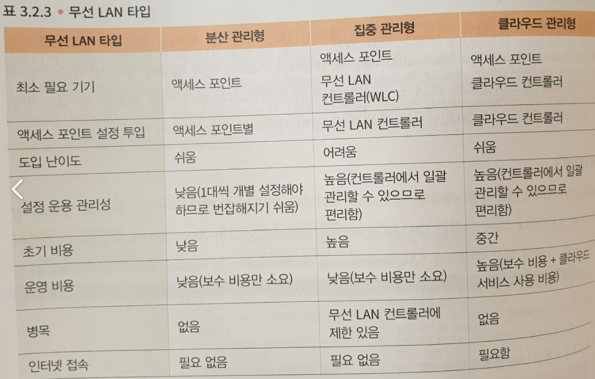

```
그림과 함께 봐야 이해가 쉬운 장이다. 책에 나온 그림을 꼭 같이 볼 것.
```

## Chapter 3 데이터링크 계층

### 3.1 유선 LAN
- 이더넷에서는 어떤 포맷으로 캡슐화하고, 어떻게 에러를 검출하는지 정의하고 있다.
- 이더넷에 의해 캡슐화된 패킷을 이더넷 프레임이라 부른다. 이더넷의 프레임 포맷에는 이더넷 II 규약과 IEEE802.3 규약이 있다.
- 웹, 메일, 파일 공유에서 인증에 이르기까지 TCP/IP로 교환하는 대부분의 패킷이 이더넷 II 규약을 사용하고 있다.
- IEEE802.3 규격은 이더넷 II를 기반으로 1985년에 발표한 규격
- 이더넷 II는 아래 5개 필드로 구성 되어 있다.
	- 프리앰블 : '이제부터 이더넷 프레임을 보냅니다'라는 합의를 의미하는 8바이트의 특별한 비트 패턴. 
	- 수신지/송신지 MAC 주소 : 이더넷 네트워크에서의 주소와 같은 것이다로 생각할 수 있다.
	- 타입 : 네트워크 계층에서 어떤 프로토콜을 사용하는지 나타내는 2바이트의 ID.
	- 이더넷 페이로드 : 네트워크 계층의 데이터 자체를 의미. IP를 사용한다면 이더넷 페이로드 = IP 패킷.
	- FCS : 이더넷 프레임이 손상되지 않았는지 확인하기 위한 4바이트 필드. 이더넷에서 에러 감지의 전부를 담당.
</br>

- MAC 주소는 1바이트씩 하이픈이나 콜론으로 구분해 12자리의 16진수로 표기한다.
- 이더넷 네트워크에서의 통신은 유니캐스트, 브로드캐스트, 멀티캐스트가 있다. 수신지에 따라 구분해서 사용하며 수신지 MAC 주소에 설정되는 값이 다르다.
- 유니캐스트는 1:1 통신이다. 송수산하는 각 단말의 MAC 주소가 송신지, 수신지 MAC 주소가 된다. 웹이나 메일 등 인터넷 통신의 대부분은 유니캐스트로 분리된다.
- 브로드캐스트는 1:n 통신이다. 어떤 단말이 브로드캐스트를 송신하면 그 이더넷 네트워크에 있는 자신 이외의 모든 단말이 그 프레임을 수신한다.
- 브로드캐스트시 송신지 MAC 주소는 송신지 단말의 것이지만, 수신지 MAC 주소에는 6바이트가 모두 '1'. 16진수로는 ff:ff:ff:ff:ff:ff 라는 특별한 값을 사용한다.
- 멀티캐스트는 1:n 통신이다. 여기서 n은 특정 그룹에 속하는 단말이다. 어떤 단말이 멀티캐스트를 송신하면 그 그룹에 있는 단말들만 그 패킷을 수신한다.
- 멀티캐스트시 송신지 MAC 주소는 송신지 단말의 것이지만, 수신지 MAC 주소는 네트워크 계층에서 사용하는 IP 버전에 따라 달라진다.
</br>

- L2 스위치는 이더넷 헤더에 포함된 송신지 MAC 주소와 자신의 포트 번호를 MAC 주소 테이블이라는 메모리상의 테이블로 관리하면서, 이더넷 프레임의 전송 대상지를 바꾸어 통신 효율을 높인다.
- 송신지에 접속된 포트를 제외한 모든 물리 포트로 전송하는걸 플러딩이라 부른다.
- VLAN은 1대의 L2 스위치를 여러 대의 L2 스위치로 가상 분할하는 기술이다.
- 포트 기반 VLAN은 하나의 포트에 하나의 VLAN을 할당하는 기능, 태그 VLAN은 이더넷 프레임에 VLAN 정보를 VLAN 태그로 붙이는 기능.

</br>

### 3.2 무선 LAN(IEEE802.11)
- IEEE802.11 프레임 포맷은 프리앰블, 프레임제어, Duration/ID, MAC 주소 1/2/3/4, 시퀀스 제어, 페이로드, FCS 로 구성된다.
- 무선 LAN은 어소시에이션 -> 인증 -> 공유키 생성 -> 암호화 통신을 거쳐 통신한다.
- 어소시에이션 단계는 어떤 액세스 포인트와 접속할지 결정하는 단계이다. 아래 3단계로 구성된다.
	- 스캔 : 액세스 포인트와 무선 LAN 단말이 서로의 존재를 인식하는 단계
	- 인증 : 오픈 시스템 인증으로 통과시킨 뒤, 실제 인증은 어소시에이션 뒤의 인증 단계에서 수행한다.
	- 어소시에이션 : 최종 확인 단계. 무선 LAN 단말은 접속할 액세스 포인트에 어소시에이션 요청을 송신, 액세스 포인트가 응답을 반환하면 어소시에이션이 완료된다.
- SSID는 무선 LAN을 식별하기 위한 문자열로, 간단히 말하면 무선 LAN의 이름이다.

- 무선 LAN 인증 방식에는 퍼스널 모드와 엔터프라이즈 모드가 있다.
- 퍼스널 모드는 비밀번호로 인증하는 방식, 엔터프라이즈 모드는 디지털 인증서나 ID/비밀번호, SIM 카드 등을 사용해 인증하는 방식이다.
- 공유키 생성 단계는 인증 단계에서 생성한 마스터키로부터 실제 암복호화에서 사용하는 공유키를 생성하는 단계.
- 4way handshake를 통해 서로 유니캐스트용 공유키, 멀티캐스트용 공유키를 생성해서 공유한다.
- 공유키가 만들어졌다면 암호화 통신을 시작한다. 무선 LAN에서 사용하는 암호화 방식에는 아래 4가지 종류가 있다.
	- WEP : 보안이 취약해서 현재는 거의 사용하지 않는다.
	- WPA : WEP를 개량해 취약성을 낮추는 것을 목적으로 한 암호화 방식.
	- WPA2 : WPA를 개량한 방식으로 가장 큰 차이는 암호화 알고리즘으로 AES를 채용한 점이다.
	- WPA3 : WPA2를 개량한 방식. 더 강력한 보안 수준을 구현하고 있다.
- 무선 LAN은 액세스 포인트 운용 관리 형태에 따라 3가지 종류로 나눌수 있다. (아래 표 참조)
<p></p>

- 무선 LAN을 구성하는 기기는 더 높은 보안 수준을 유지하고 깨끗한 전파 환경을 유지하기 위해 아래와 같은 기능들도 제공한다.
	- 게스트 네트워크 : 방문자에게 제공되는 무선 LAN 환경.
	- MAC 주소 필터링 : 단말의 MAC 주소를 기반으로 필터링 하는 기능.
	- 웹 인증 : 웹브라우저에서 사용자 이름과 비밀번호를 입력해 인증하는 방식.
	- 밴드 스티어링 : 2.4GHz 대역과 5GHz 대역의 양쪽 주파수 대역에 대응하는 무선 LAN 단말을 전파 간섭이 발생하기 어려운 5GHz 대역으로 유도.
